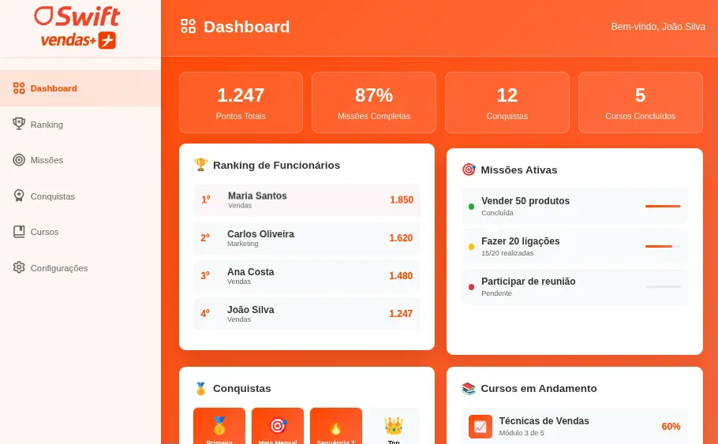
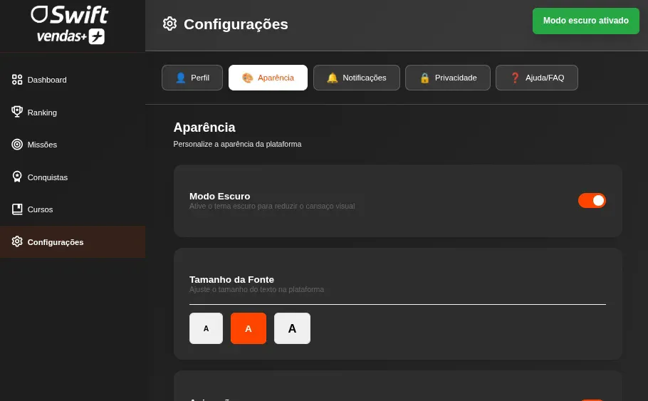

# Swift Vendas+ 🎮

> Plataforma de gamificação para engajar colaboradores e impulsionar resultados em lojas Swift

## 📋 Sobre o Projeto

Este projeto foi desenvolvido como atividade acadêmica do primeiro semestre para aplicar conhecimentos de **desenvolvimento front-end**. A proposta é criar uma solução de gamificação para motivar colaboradores das lojas Swift, transformando rotinas de trabalho em experiências dinâmicas e motivadoras.

### Objetivos da Gamificação

- ✅ Crescimento de carreira
- ✅ Aumento do ticket médio
- ✅ Maior efetividade em cross-sell
- ✅ Melhoria na experiência do cliente (NPS)
- ✅ Identificação e personalização para clientes

## 🚀 Funcionalidades

- **Dashboard Interativo**: Visualização de pontos totais, missões completas, conquistas e cursos
- **Sistema de Ranking**: Competição saudável entre funcionários com pontuação em tempo real
- **Missões Ativas**: Desafios diários como "Vender 50 produtos", "Fazer 20 ligações" e "Participar de reunião"
- **Conquistas**: Sistema de badges e troféus para reconhecimento
- **Cursos em Andamento**: Módulos de treinamento (ex: Técnicas de Vendas)
- **Configurações Personalizáveis**: Modo escuro.

## 🛠️ Tecnologias Utilizadas

- **HTML5**: Estruturação das páginas
- **CSS3**: Estilização e layout responsivo
- **JavaScript**: Interatividade e lógica do sistema
- **Bootstrap**: Framework CSS para componentes responsivos

## 📦 Como Executar o Projeto

### Pré-requisitos

- Navegador web moderno (Chrome, Firefox, Edge, etc.)
- [Live Server](https://marketplace.visualstudio.com/items?itemName=ritwickdey.LiveServer) (extensão do VS Code) ou servidor local similar

### Instalação e Execução

1. Clone este repositório

```bash
git clone https://github.com/seu-usuario/swift-vendas-plus.git
```

2. Navegue até a pasta do projeto

```bash
cd swift-vendas-plus
```

3. Abra o projeto no VS Code

```bash
code .
```

4. Execute com Live Server
   - Clique com o botão direito no arquivo `index.html`
   - Selecione "Open with Live Server"
   - O projeto abrirá automaticamente no navegador

## 💡 Como Usar

1. **Dashboard**: Página inicial mostra seu progresso geral e estatísticas
2. **Ranking**: Confira sua posição entre os colaboradores
3. **Missões**: Acompanhe e complete desafios diários
4. **Conquistas**: Visualize suas medalhas e troféus conquistados
5. **Cursos**: Continue seu desenvolvimento profissional
6. **Configurações**: Personalize a aparência da plataforma

## 📸 Screenshots

### Dashboard


_Visão geral com estatísticas e missões ativas_

### Configurações


_Personalização com modo escuro_

## 🎯 Aprendizados

Este projeto permitiu aplicar na prática conceitos fundamentais de:

- Estruturação semântica com HTML5
- Estilização responsiva com CSS3 e Bootstrap
- Manipulação do DOM com JavaScript
- Design de interfaces gamificadas
- Organização de código front-end

## 👥 Autores

**RENAN FRESATTO MARTINS**
**ARTHUR TASSINARI RESENDE**
**MIGUEL SIQUEIRA DE LIMA**
**JULIO CESAR BASTOS DE VARGAS JUNIOR**
**JOÃO RICARDO FIDELIX BUENO**

- Curso: 1°ano - Analise e Desenvolvimento de Sistemas
- Instituição: FIAP
- LinkedIn: https://www.linkedin.com/in/renan-fresatto-47790b297/

## 📄 Licença

Este projeto foi desenvolvido para fins educacionais como parte do primeiro semestre do curso.
